# OmniView IQ — System Workflow & Internal Functional Units

**Site:** ISBM-PET Bottle Manufacturing, Pune
**Purpose of this document:** trace exactly how a piece of data moves through the system, end to end, and what happens *inside* each functional unit along the way — including the time-ordered message exchanges for the scenarios that matter most to this POC.
**Companion documents:** `OmniView_IQ_POC_Plan_PRD_and_Architecture.md` (plan/PRD/cost), `OmniView_IQ_POC_Architecture_High_and_Low_Level.md` (architecture rationale)

---

## 1. How to Read This Document

Three views of the same system, each answering a different question:

- **§2 System Workflow** — the single, top-to-bottom journey of one reading, start to finish.
- **§3 Functional Units** — zoom into each stage and see what it does *internally*, independent of the others. Each unit has a defined input, a defined output, and its own internal steps.
- **§4 Sequence Diagrams** — the actual time-ordered conversation between units for five real scenarios this POC needs to prove. This is the "who talks to whom, in what order, and what do they say" view — the one that matters most for building and testing.

---

## 2. End-to-End System Workflow

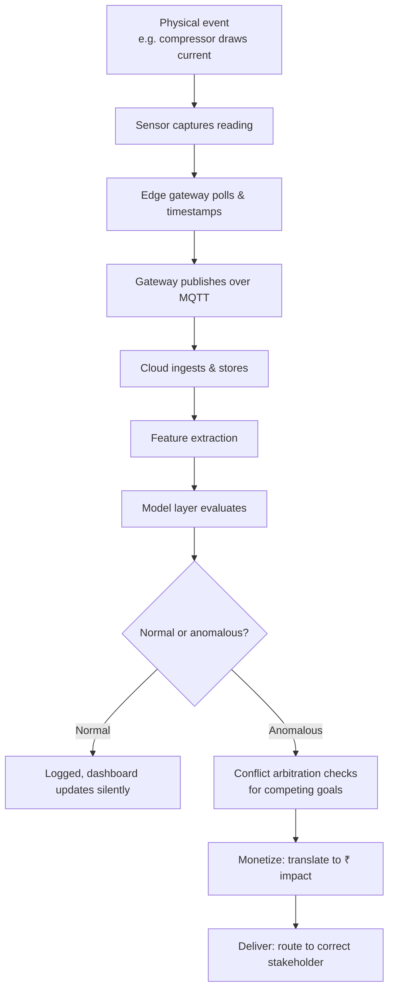

This is the same flow regardless of which physical event triggers it — a vibration spike, a pressure decay, or a current draw approaching the demand limit all travel this identical path. What changes between scenarios is only what happens at the decision diamond (H) and downstream of it — Section 4 walks through five concrete versions of this path.

---

## 3. Functional Units — Internal Workflow

Each unit below is intentionally self-contained: it has one job, a clear input, and a clear output. This is what makes the system testable piece by piece rather than only as a whole.

### 3.1 Sensing Unit (Layer 1)
**Input:** physical phenomena (current, vibration, pressure, temperature). **Output:** raw analog/digital readings on a Modbus-addressable bus.

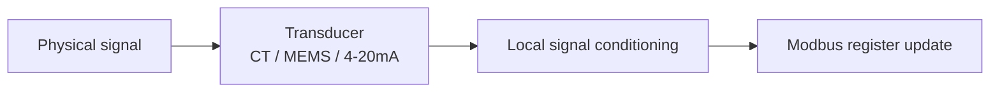
The sensing unit does no interpretation — a vibration node doesn't know what "critical" means, it just continuously updates a register with the latest RMS velocity value. Keeping this unit "dumb" is deliberate: it means the sensing hardware never needs a firmware update when the anomaly-detection logic changes.

### 3.2 Edge Connectivity Unit (Layer 2)
**Input:** Modbus register values from up to four sensor types. **Output:** timestamped JSON payloads over MQTT.

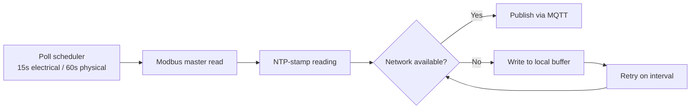
This unit's entire reason for existing is the "No" branch. Everything else here is a straightforward poll-and-forward loop; the offline buffer and retry loop are what make the system trustworthy on an unreliable cellular connection.

### 3.3 Ingestion & Storage Unit (Layer 3, part 1)
**Input:** MQTT JSON payloads. **Output:** indexed time-series records.

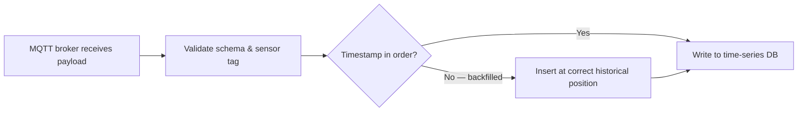
The branch at C is what makes offline backfill actually work: a reading that arrives late (because the gateway buffered it during an outage) still gets written into its correct place in the timeline, not appended as if it just happened.

### 3.4 Feature Extraction & Modeling Unit (Layer 3, part 2)
**Input:** raw stored readings. **Output:** an evaluated state — normal, or a specific named anomaly.

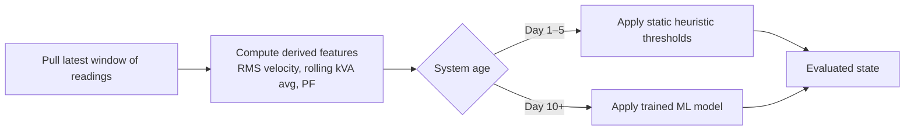
This is the unit responsible for the cold-start strategy: the branch at C is a literal switch that changes behavior as the system matures, without needing anyone to manually "turn on" the ML model — it activates once enough historical data exists to train it reliably.

### 3.5 Intelligence / Arbitration Unit (Layer 4)
**Input:** an evaluated anomalous state. **Output:** a single resolved action recommendation.

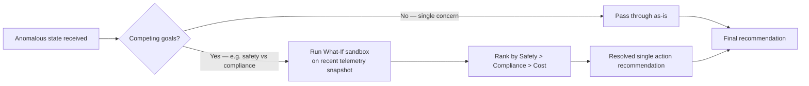
Most events pass straight through this unit untouched (branch C) — arbitration only does real work when two goals genuinely conflict, which is the rare, high-stakes case this unit exists to handle correctly.

### 3.6 Monetize Unit (Layer 5)
**Input:** a resolved recommendation or a routine reading. **Output:** the same event, annotated with a ₹ figure.

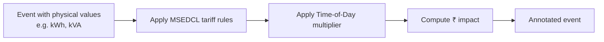
This unit is intentionally kept separate from the intelligence unit — tariff logic changes independently of anomaly-detection logic (e.g. if MSEDCL revises rates), and this separation means one can be updated without touching the other.

### 3.7 Deliver & Act Unit (Layer 6)
**Input:** an annotated, resolved event. **Output:** a delivered notification to exactly the right person.

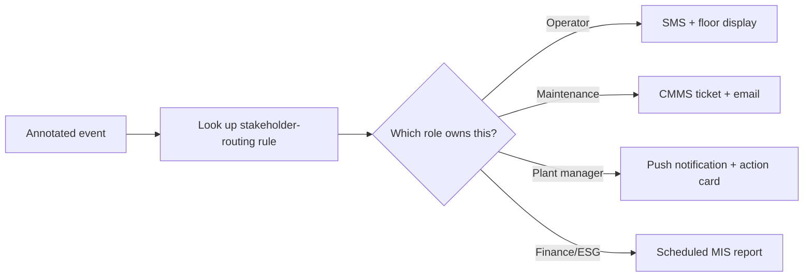
The routing table this unit consults is what prevents alert fatigue (Section 3.3 of the architecture doc) — every event has exactly one designated recipient type, never a broadcast to all four.

---

## 4. Sequence Diagrams — Time-Ordered Scenarios

These are the conversations that actually happen between units over time. Five scenarios cover everything this POC needs to prove.

### 4.1 Routine Telemetry Cycle (the baseline, happens continuously)

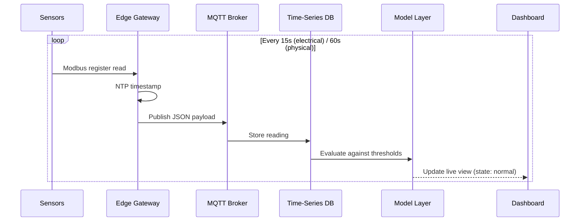
This loop runs continuously and silently — no alert fires, no arbitration engages. It's the background heartbeat that all the other scenarios below interrupt or extend.

### 4.2 Predictive Demand (MD) Breach Alert

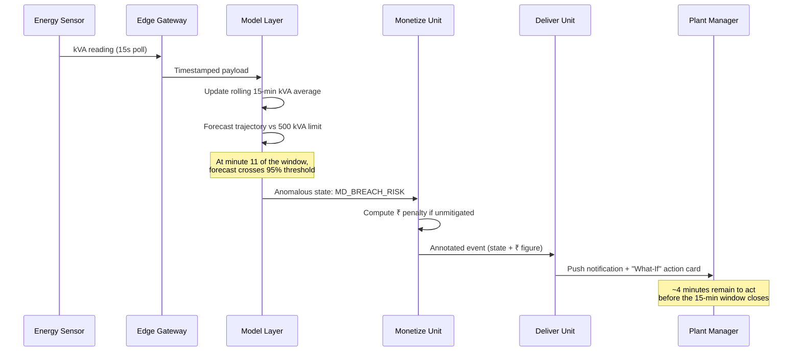
The critical design detail here is the **minute-11 trigger point** — chosen specifically to leave a real window for a human to act before the billing window mathematically locks in.

### 4.3 Lazy-Idle Detection

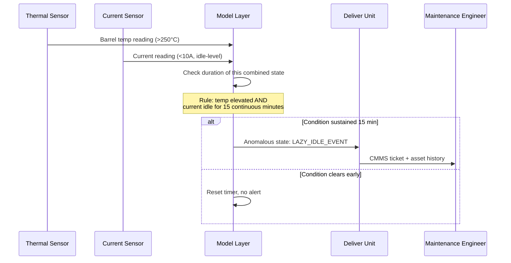
This is a heuristic rule (from the Day 1–5 static-threshold branch in §3.4) — it doesn't need a trained model because the physical signature (heat without work) is unambiguous by definition.

### 4.4 Offline Outage & Chronological Backfill

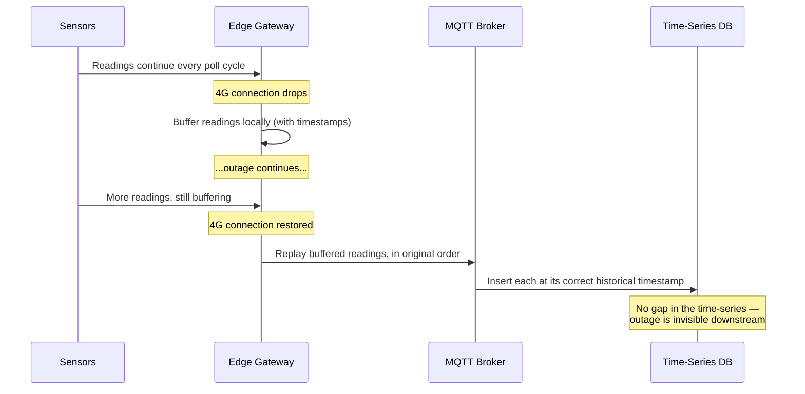
This sequence is what makes an idle-waste capture defensible even if the network happened to drop during the very changeover event being measured — nothing downstream ever sees a gap.

### 4.5 Conflict Arbitration — Safety vs. Compliance Stress Test

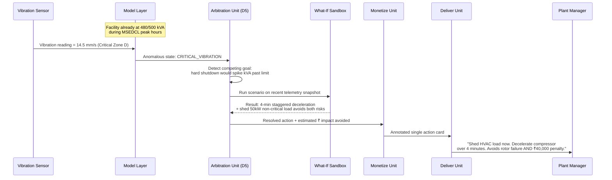
Note that only **one** action card reaches the Plant Manager — not two competing alerts. That consolidation, happening inside the arbitration unit before anything is delivered, is the entire point of Layer 4 existing as a separate unit from Layer 6.

---

## 5. Cross-Reference — Which Functional Unit Appears in Which Sequence

| Functional Unit | 4.1 Routine | 4.2 MD Breach | 4.3 Lazy Idle | 4.4 Offline | 4.5 Arbitration |
|---|:---:|:---:|:---:|:---:|:---:|
| Sensing | ✓ | ✓ | ✓ | ✓ | ✓ |
| Edge Connectivity | ✓ | ✓ | — | ✓ | — |
| Ingestion & Storage | ✓ | — | — | ✓ | — |
| Feature Extraction & Model | ✓ | ✓ | ✓ | — | ✓ |
| Intelligence/Arbitration | — | — | — | — | ✓ |
| Monetize | — | ✓ | — | — | ✓ |
| Deliver & Act | — | ✓ | ✓ | — | ✓ |

Reading this table top to bottom for any single column tells you exactly which units need to be working — and therefore which units need to be tested — for that scenario to be demonstrable during the POC.

---

*This document is the workflow/sequence reference; system rationale lives in `OmniView_IQ_POC_Architecture_High_and_Low_Level.md`, and the full execution plan lives in `OmniView_IQ_POC_Plan_PRD_and_Architecture.md`.*
