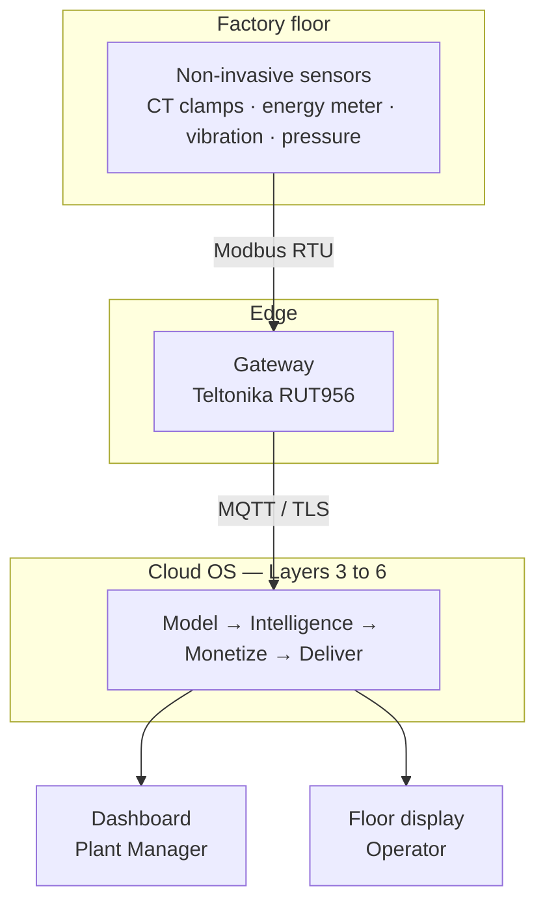
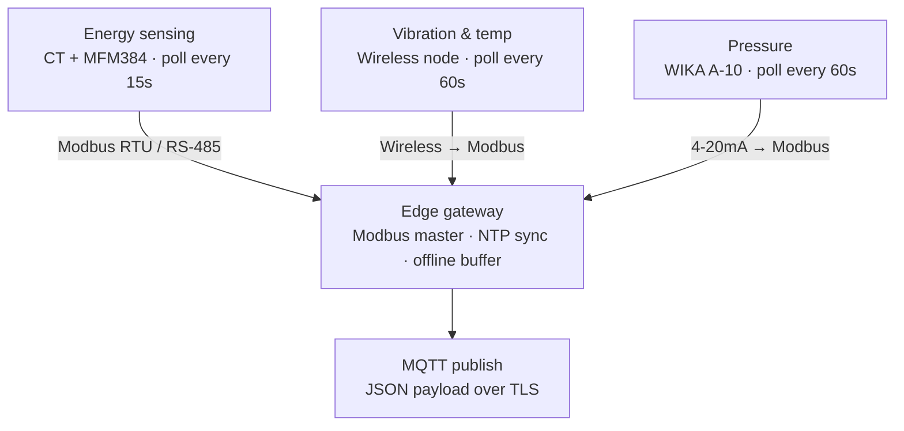
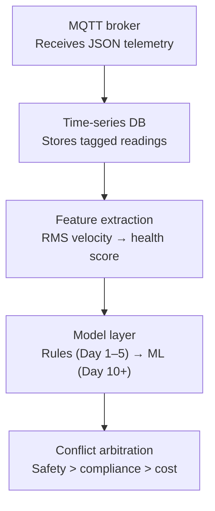
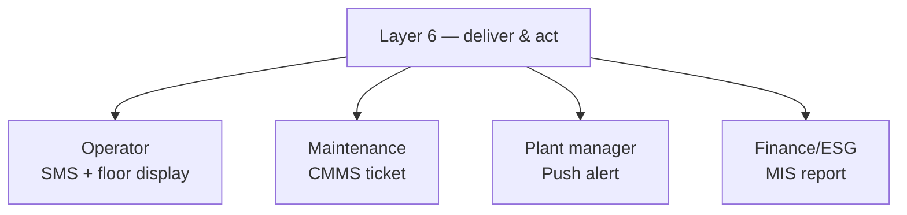

# OmniView IQ — POC Architecture (High-Level & Low-Level)

**Site:** ISBM-PET Bottle Manufacturing, Pune
**Purpose of this document:** a single reference that explains *what* the system architecture is, *why* each layer exists, and *how* data actually moves through it — from a sensor clipped onto a live cable to an alert landing in the right person's hand.
**Companion documents:** `OmniView_IQ_POC_Plan_PRD_and_Architecture.md` (full plan, PRD, sensor list, cost comparison), `Pune_Factory_Sensor_Metaplan.docx` (source technical/financial detail)

---

## 1. How to Read This Document

The architecture is presented at two zoom levels, because they answer two different questions:

- **High-level architecture** answers *"what are the big pieces, and how does data flow between them?"* — this is what you'd show a client in the first two minutes.
- **Low-level architecture** answers *"how exactly does each piece work?"* — protocols, polling intervals, timing guarantees, and the decision logic inside the cloud. This is what an engineer needs to actually build and validate it.

Both are built around one guiding constraint: **the facility has zero existing digital infrastructure** (no PLC, no SCADA, no exportable meter). Every design decision below — non-invasive sensors, edge-first buffering, a layered software stack — exists because of that one fact.

---

## 2. High-Level Architecture

### 2.1 Diagram

### 2.2 What each block is, and why it's there

**Floor sensors** — a Selec MFM384 energy meter (fed by split-core CT clamps), a wireless vibration/temperature node, and a WIKA pressure transmitter. All three are chosen specifically because they clip, mount, or tap onto **existing** infrastructure — no cable is cut, no production line stops, and no OEM warranty is put at risk. This matters more than it sounds: it's the reason this POC can be installed in a live 24/7 facility at all.

**Edge gateway (Teltonika RUT956)** — the single physical box that turns three independent sensors into one coherent, cloud-ready data stream. It exists at the edge (not just in the cloud) for one reason: **this facility's internet connection cannot be trusted to be always-on**, and if the system depended on a live connection to function, a single dropped 4G session would silently blow a hole in the data used to calculate demand-penalty risk. The gateway polls every sensor locally, timestamps every reading, and keeps working even if the cloud link disappears for hours.

**Cloud OS (Layers 3–6)** — this is where raw numbers become a financial or safety decision. It is deliberately structured as layers rather than one monolithic service, because each layer has a genuinely different job: understanding what "normal" looks like (Model), deciding what to do when two goals conflict (Intelligence), translating physics into rupees (Monetize), and getting the right message to the right person (Deliver). Section 3.2 breaks this open in detail.

**Dashboard & floor display** — two different outputs for two different audiences on two different timescales. The Plant Manager needs a considered view with financial context; the operator on the floor needs a single glanceable number they can react to in seconds. Sending both audiences the same interface would fail one of them.

### 2.3 Why this shape, and not something simpler
A simpler design — sensor straight to cloud, no edge gateway — would be cheaper to build but would fail the moment the factory's internet dropped during a real changeover event, which is exactly when the most important data (the idle-waste baseline) needs to be captured. The edge-first design trades a small amount of extra hardware complexity for guaranteed data integrity during the events that actually matter for this POC's proof.

---

## 3. Low-Level Architecture

### 3.1 Field & Edge Layer — Protocols and Timing

**Why the polling intervals differ.** Electrical values (kVA, current, PF) are polled every 15 seconds because the whole demand-penalty proof depends on reconstructing a rolling 15-minute average accurately — undersampling here would blur exactly the spike we're trying to catch. Vibration and pressure move on slower physical timescales (bearing wear and pipeline leaks don't develop in seconds), so 60-second polling is sufficient and avoids over-collecting data with no analytical benefit.

**Why NTP synchronization is not optional.** Every sensor reading gets a millisecond-accurate timestamp from the gateway. If the gateway's clock drifts more than roughly 30 seconds from the utility's own meter clock, the system's calculated 15-minute billing window stops lining up with MSEDCL's actual window — which means a predictive alert could fire at the wrong moment, or miss the real one entirely. This single design detail is what makes the demand-penalty prediction trustworthy rather than approximate.

**Why offline buffering happens at the edge, not in the cloud.** If the 4G connection drops, the gateway keeps polling and storing locally, then replays everything **in the original chronological order** once the connection returns. This preserves an unbroken time-series in the cloud even through a real network outage — critical, because a gap in the data during a captured idle-waste event would make that event's ₹ figure impossible to defend.

### 3.2 Cloud Analytics Pipeline

Walking down this pipeline in order:

1. **MQTT broker** — the single ingestion point for every reading the gateway sends. Using MQTT (rather than, say, a raw HTTP POST per reading) keeps the connection lightweight and resilient to the kind of intermittent cellular link this site will have.
2. **Time-series database** — every reading is stored with its sensor tag and timestamp, forming the historical record that everything downstream depends on. This is also what makes offline backfill possible: replayed data slots into the correct point in the timeline rather than appearing as a burst "now."
3. **Feature extraction** — raw numbers become meaningful signals here. Raw vibration data (a stream of velocity values) is converted into an ISO 10816-3 health score; raw current and voltage become power factor and apparent power. This is the layer that turns "sensor output" into "engineering meaning."
4. **Model layer** — this is the system's cold-start strategy, and it exists because there's no historical baseline to learn from on Day 1. Days 1–5 run on static, industry-standard heuristic thresholds (e.g., vibration above 7.1 mm/s = critical, per ISO 10816-3). By Day 10+, enough real site data exists for a statistical/ML model (LSTM or XGBoost) to take over and produce a genuinely site-specific forecast rather than a generic threshold. **This progression is deliberate** — it means the system produces useful alerts from day one, without waiting weeks for a model to mature, while still improving in accuracy as real data accumulates.
5. **Conflict arbitration** — the most structurally important piece of the whole pipeline, and worth explaining on its own below.

#### Why conflict arbitration exists
A naive system would fire two alerts independently when two goals disagree — for example, "shut the compressor down now" (safety) and "don't let load spike above the contract limit" (compliance) — and leave a human to figure out that acting on one makes the other worse. Conflict arbitration runs a short simulation against a read-only snapshot of recent telemetry (a "what-if" sandbox) to find a single resolution that satisfies the higher-priority goal without carelessly triggering the lower-priority failure. The priority order is fixed: **Safety first, Compliance second, Cost third** — cost savings never override a safety call, and a compliance concern never overrides a safety concern. The output is always a single, human-readable recommendation — not an automatic action. **This system detects and recommends; it does not auto-actuate equipment.**

*Concrete example:* at 480/500 kVA during peak hours, a compressor bearing spikes to a critical vibration reading. A hard shutdown is the correct isolated safety response, but it would force backup pumps to full load and spike demand past the contract limit, guaranteeing a penalty. Arbitration instead proposes a 4-minute staggered deceleration plus shedding a specific non-critical load — solving both problems with one action card, rather than solving one and creating the other.

### 3.3 Alert Routing & Delivery (Layer 6)

**Why routing matters as much as detection.** A system that sends every alert to every stakeholder trains people to ignore all of them within a week — this is the standard failure mode of industrial monitoring tools. Layer 6 instead asks "who can actually act on this specific piece of information?" and sends it only there:

| Stakeholder | Gets alerted when | Why them specifically |
|---|---|---|
| Plant floor operator | Sudden breakdown, or vibration crosses the critical ISO zone | They're standing next to the machine and can physically respond in seconds |
| Maintenance engineer | Vibration enters a "restricted" (pre-critical) zone, or current drifts abnormally | They own scheduling repairs before the problem becomes urgent |
| Plant/facility manager | The rolling 15-minute demand forecast is trending toward breach | They're the one authorized to shed load or approve an emergency action |
| Finance/ESG officer | Month-end, with penalty tracking and rebate summaries | Their job is the accounting record, not the real-time response |

### 3.4 The Full Layer Map
For reference, here's how the diagrams above map onto the six-layer architecture referenced throughout the POC plan:

| Layer | Name | What lives here |
|---|---|---|
| 0 | Site Configuration | The site's own thresholds, tariff parameters, and machine list — nothing below this layer hardcodes site-specific facts |
| 1 | Sense | The physical sensors and their protocol adapters (Section 3.1) |
| 2 | Connect | The edge gateway — polling, NTP sync, offline buffering (Section 3.1) |
| 3 | Model | Feature extraction and the cold-start rules→ML progression (Section 3.2, steps 3–4) |
| 4 | Intelligence | Conflict arbitration (Section 3.2, step 5) |
| 5 | Monetize | Converts kWh/kVAh into ₹ using MSEDCL tariffs; not pictured separately above but sits between arbitration and delivery |
| 6 | Deliver & Act | Alert routing (Section 3.3) |

---

## 4. Design Rationale — Summary

| Design choice | Problem it solves |
|---|---|
| Non-invasive sensors only | Zero production downtime; no OEM warranty risk on a live factory |
| Edge gateway with local buffering | Unreliable factory internet must not corrupt the historical data used for financial proof |
| NTP-synced timestamps | The 15-minute demand window must mathematically match the utility's own billing window |
| Differentiated polling intervals | Electrical events move in seconds; mechanical/pneumatic events move in minutes — sampling matches the physics |
| Rules-first, ML-later model layer | Produces useful output from Day 1 without waiting weeks for a trained model |
| Conflict arbitration (Safety > Compliance > Cost) | Prevents the system from "solving" one problem by silently creating a worse one |
| Role-based alert routing | Prevents alert fatigue; ensures the person who can act is the person who's notified |
| Human-in-the-loop only (no auto-actuation) | Keeps a person in control of any action taken on live equipment |

---

*This document is the architecture reference; the full execution plan (timeline, acceptance criteria, cost comparison, to-do list) lives in `OmniView_IQ_POC_Plan_PRD_and_Architecture.md`.*
