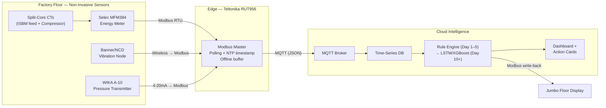
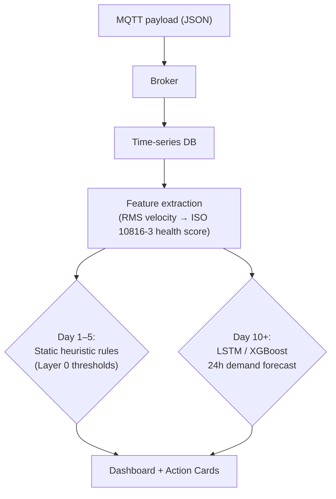

# OmniView IQ — Pune ISBM-PET Facility POC
## Plan of Action, PRD, Sensor List & Architecture

**Document Type:** POC Execution Package (client-facing + internal)
**Site:** ISBM-PET Bottle Manufacturing, Pune (MSEDCL HT-I jurisdiction)
**Built from:** `Pune_Factory_Sensor_Metaplan.docx` (hardware/financial detail) + `OmniView_IQ_Bottle_Mfg_Factory_Profile_and_POC_Scope.md` (site profile)
**Status:** DRAFT — all rupee figures, machine models, and tariff numbers below are the metaplan's *assumed* defaults, not this site's confirmed data. Section 9 (To-Do) starts with confirming them.

---

## 1. Plan of Action — What, Why, How, Where

### 1.1 What
Instrument **two nodes only** — the primary High-Pressure Compressor (25–40 bar) and the main electrical feed of the ISBM machine (modeled on a Nissei ASB-70DPH) — with non-invasive sensors, and run a 3-week edge-to-cloud pilot that produces three things: a real baseline of "phantom run" waste, a real capture of a near-miss demand-penalty spike, and a real capture of a "lazy idle" thermal-degradation event. Nothing else on the floor gets touched in this phase.

### 1.2 Why
The facility has **zero existing digital instrumentation** (confirmed — no PLC, SCADA, or exportable meter). Today, energy cost is reviewed only after the monthly MSEDCL bill arrives, and machine health is only understood after a failure has already stopped the line. The financial exposure this creates is concrete, not hypothetical:
- A single 15-minute kVA breach above the contracted demand locks in a penalty for the **entire month** (₹15,000–₹40,000 in the modeled scenario).
- Compressor leak-fighting is modeled at **20–30% of compressor electrical spend** wasted.
- A single "lazy idle" incident produces up to an hour of unsellable scrap on restart.
None of this needs a full IIoT rollout to prove — it needs one meter, correctly placed, for three weeks.

### 1.3 How
- **Non-invasive only:** split-core CT clamps around live phases, magnetic/epoxy-mounted vibration nodes, a pressure transmitter tapped into an existing gauge port. No wiring cut, no production stoppage, no OEM warranty risk.
- **Edge-first, cloud-second:** a local gateway polls all sensors over Modbus RTU, timestamps with NTP, buffers offline, and bridges to the cloud over MQTT — so the pilot doesn't depend on unbroken factory internet.
- **Baseline before claims:** every hero metric is only stated once it's backed by this site's own captured data (Week 1 idle event, Week 2 spike, Week 2 lazy-idle event) — never a projected or industry-average number.

### 1.4 Where
| Node | Physical location | What's measured there |
|---|---|---|
| Main electrical panel (compressor + ISBM feed) | Exterior door-mount of the panel | kVA, kW, PF, THD, per-phase current |
| Compressor bearing housing | Magnetic/epoxy mount | RMS vibration velocity, surface temperature |
| ISBM barrel / hot-runner zone | Surface-mounted thermal probe | Barrel temperature (correlated against current draw) |
| Compressor output receiver manifold | Existing pneumatic gauge port | Pressure (bar), decay rate |
| Factory floor (visible to operators) | Wall/pillar near the panel | Jumbo display — live kVA / active warnings |

---

## 2. PRD — Product Requirements Document

### 2.1 Problem Statement
The facility cannot see, in real time, (a) how close it is to a demand-penalty-triggering kVA breach, (b) how much of its compressor's energy is wasted on leaks and idle-loaded running, or (c) when a machine is silently degrading (thermally or mechanically) rather than actually producing. All three are currently invisible until the monthly bill or a breakdown makes them visible — after the cost is already locked in.

### 2.2 Goals (this POC)
1. Prove, with the site's own captured data, that MD-penalty risk is detectable and avoidable before the 15-minute window closes.
2. Prove, with the site's own captured data, a measured ₹ figure for compressor "phantom run" waste.
3. Prove that a lazy-idle / thermal-degradation event can be automatically detected and flagged in near real time.
4. Deliver all of the above without a single minute of added production downtime.

### 2.3 Non-Goals (explicitly out of scope for this POC)
- Predictive maintenance / Remaining Useful Life estimation (needs weeks of baseline + real failure history — Phase 2 candidate).
- Full-line instrumentation (conveyor, labeler, packer).
- Multi-line or multi-site rollout.
- Automated closed-loop control (this POC issues *recommendations*/action cards to a human, it does not auto-actuate equipment).
- Registry-grade carbon credit certification (any carbon/ESG number shown is estimated, self-calculated, non-registry).

### 2.4 Users / Personas
| Persona | What they need from this POC |
|---|---|
| Plant Manager | A believable, undeniable ₹ number and a "so what do I do about it" action card |
| Finance / Procurement | Confirmation the MD penalty math ties to their actual MSEDCL bill line items |
| Shift Operator | The jumbo floor display — a simple, glanceable "we're getting close to the limit" signal |
| Electrical/Maintenance Engineer | Confidence the install is genuinely non-invasive and won't void warranties or trip breakers |

### 2.5 Functional Requirements
- FR1: Poll electrical parameters (V, I, kVA, kW, PF, THD) at ≤15-second intervals.
- FR2: Poll vibration and temperature at ≤60-second intervals.
- FR3: Compute a rolling 15-minute kVA average that mathematically mirrors MSEDCL's own integration logic.
- FR4: Emit a predictive alert when the rolling average trajectory is forecast to breach the contracted demand, with enough lead time (target: by minute 11 of the 15-minute window) for a human to act.
- FR5: Detect "lazy idle" state — barrel/zone temperature remaining elevated while current indicates idle/off — and alert within 15 minutes of onset.
- FR6: Detect pneumatic pressure decay while the compressor remains loaded, as a leak proxy.
- FR7: Buffer all telemetry locally through any network outage and backfill chronologically on reconnect — no data gaps in the cloud time-series.
- FR8: Surface a live dashboard with the locked hero metrics (Section 2.6) and generate at least one human-readable "action card" recommendation during the pilot.

### 2.6 Hero Metrics (what the dashboard leads with)
1. Live kVA vs. Contracted Sanctioned Demand
2. Projected Monthly Demand Penalty Avoided (₹)
3. Specific Energy Consumption (kWh per 1,000 bottles molded)
4. High-Waste Idling Motor Load (%)

### 2.7 Non-Functional Requirements
| Requirement | Target |
|---|---|
| Timestamp accuracy (clock drift) | NTP-synced, sub-second; must not drift >5s over the pilot (30s drift is enough to misalign the 15-min MD window and invalidate the alert) |
| Installation downtime | Zero production stoppage |
| Data completeness | No unbacked null windows post-buffering/backfill |
| Alert lead time (MD breach) | ≥4 minutes before the 15-minute window closes |
| Vibration measurement standard | ISO 10816-3, Class II thresholds (2.8 / 7.1 mm/s bands) |

### 2.8 Success Metrics for the POC Itself
- At least one real MD-risk near-miss captured and correctly flagged with lead time.
- At least one real idle/changeover window with a measured ₹ waste figure.
- At least one lazy-idle event (real or deliberately triggered) correctly tagged.
- Dashboard live and demo-able to the Plant Manager by Day 21.

---

## 3. Sensor List

| Component | Make & Model | Function | Est. Unit Cost (INR) | Availability | Notes |
|---|---|---|---|---|---|
| Edge gateway / central unit | Teltonika RUT956 (Cellular Industrial Router) | Modbus polling, offline buffering, MQTT bridging, dual-SIM failover | 22,000–29,000 | High — standard stock | Brain of the deployment; RS232/RS485 + 4G LTE Cat 4 |
| Digital energy meter | Selec MFM384-C-CE | 3-phase kVA/kW/PF/THD, Class 0.5S | 4,000–6,000 | Very high | Panel-mounted, RS485 Modbus RTU |
| Current transformers | Selec SCCT-30/20 (Split-Core) | Non-invasive current sensing on live phases | 1,500–2,000/phase | Very high | Snap-on install, no power cut needed |
| Vibration & temperature node | Banner Q45 / NCD Wireless MEMS | ISO 10816-3 RMS velocity + surface temp | 25,000–35,000 | Medium — 1–2 week lead | **Critical path item** for procurement |
| Pressure transmitter | WIKA A-10 (0–40 bar) | Pneumatic decay / leak proxy, 4-20mA → Modbus | ~15,000 | High — Pune local mfg | Taps into existing gauge port |
| Jumbo floor display | Multispan RS-6006 | Operator-facing live kVA / warnings | 15,000–22,000 | High | Modbus input, 4" 6-digit LED |

**Estimated hardware CapEx (one ISBM node + one compressor node, excl. installation labor): ₹95,000–₹1,20,000.**
A single avoided MD penalty (up to ₹40,000) implies a payback horizon under 90 days — but this is the metaplan's modeled figure, not yet this site's confirmed number (see Section 8).

**Protocol note:** every device above speaks Modbus RTU/RS-485 or is bridged to it — this is what lets one gateway serve the whole node without proprietary PLC integration.

---

## 4. POC — High-Level Architecture



**Plain-text version:**
```
Sensors (CT clamps, energy meter, vibration node, pressure transmitter)
        → Teltonika RUT956 edge gateway (Modbus polling, NTP timestamp, offline buffer)
        → MQTT → Cloud time-series DB → Rule engine / ML models
        → Dashboard (Plant Manager) + Jumbo Display (Operator floor)
```

---

## 5. POC — Low-Level Architecture

### 5.1 Physical / Serial Layer
- All sensors daisy-chained on a single twisted-pair RS-485 run per node, terminating at the RUT956's RS485 port.
- Selec MFM384, the vibration wireless-receiver gateway, and the pressure sensor's 4-20mA-to-Modbus converter all present as Modbus RTU slaves.

### 5.2 Polling & Timing
| Data type | Poll interval | Reason |
|---|---|---|
| Electrical (V/I/kVA/kW/PF/THD) | 15s | Needed for demand-forecast data density |
| Vibration / surface temperature | 60s | Slower-moving physical parameters |
| Pressure | 60s (tunable) | Leak decay is a slow trend, not a spike |

- **NTP sync is mandatory, not optional:** every packet timestamped at the edge to millisecond accuracy. A 30-second drift would misalign the rolling 15-minute kVA window against MSEDCL's own meter clock and invalidate the predictive alert entirely.

### 5.3 Edge Logic (RutOS on the RUT956)
- Acts as Modbus Master; polls registers per the table above.
- Local flash buffer caches telemetry through any 4G LTE drop.
- On reconnect: chronological backfill to cloud, no reordering, no data loss — this is what keeps the ML baseline uncorrupted.

### 5.4 Cloud Pipeline


### 5.5 Example Heuristic Rule (Day 1–5, before ML matures)
> IF `barrel_temp > 250°C` AND `current < 10A` for a sustained `15 min` → flag `LAZY_IDLE_EVENT`

### 5.6 Rolling MD Window Logic
- Continuously computes a rolling 15-minute time-weighted kVA average, mirroring MSEDCL's own integration method (not instantaneous peaks).
- At minute 11 of any window trending toward breach, emits a high-priority alert — leaving a real window for human intervention before the month's penalty is mathematically locked in.

### 5.7 Conflict Arbitration Logic (Safety > Compliance > Cost)
Documented here because it's a genuine low-level design decision, not just a policy statement: when a mechanical safety trigger (e.g., vibration >7.1 mm/s, ISO Zone D) and a compliance trigger (kVA approaching limit) fire together, the engine does not blindly execute the isolated "correct" response for either (hard shutdown vs. do-nothing). It runs a short simulation (digital-twin sandbox, read-only snapshot of recent telemetry) to find a path satisfying both — e.g., a staggered compressor deceleration plus shedding a non-critical load — and presents it as a single Human-in-the-Loop action card rather than auto-actuating anything.

**This POC implements the detection and the recommendation. It does not implement auto-actuation** — see Non-Goals (2.3).

---

## 6. Client Acceptance — Criteria & Probability Drivers

### 6.1 What actually moves a client from skeptical to convinced (in order of persuasive weight)
1. **Live, in-front-of-them demo of the install itself.** Clipping a CT clamp onto a running motor and showing a live current reading within two minutes is worth more than any slide.
2. **A real captured idle event with a real ₹ figure** — not a projected or industry-average number. This is why Week 1's changeover-window capture is the single most important data point in the whole pilot.
3. **A near-miss MD spike genuinely caught by the system**, ideally with the exact minute/mechanism explained (e.g., "compressor load + barrel heater ramp overlapped at 18:04").
4. **Zero production disruption during install** — removes the main objection maintenance/ops teams raise about any new hardware.
5. **Numbers that tie to their own MSEDCL bill**, not generic tariff assumptions — this is why confirming their actual contracted demand and tariff slab (Section 8) matters more than any other single open item.

### 6.2 Acceptance-Probability Assessment (honest, not a sales number)
| Factor | Assessment |
|---|---|
| Technical feasibility of non-invasive install | High confidence — CT clamps, magnetic vibration mounts, and gauge-port pressure taps are all standard, low-risk installs |
| Probability of capturing a real idle/changeover event in 3 weeks | High — changeovers already happen 1–3×/week per the site profile, so the window will very likely include at least one |
| Probability of capturing a real MD near-miss in 3 weeks | Moderate — depends on whether compressor + heater startup actually overlap during the pilot window; cannot be guaranteed, only made likely by watching for it |
| Probability of a real lazy-idle event occurring organically | Moderate — if it doesn't occur naturally, the plan allows a **deliberate, disclosed test** during a scheduled break, which is acceptable since it's testing detection logic, not fabricating a client-facing claim |
| Client's likely biggest objection | "Is this ₹ number real or a sales estimate?" — mitigated entirely by Section 6.1's discipline of never stating a number before the data backing it exists |

**Bottom line:** the POC's design is deliberately built so that acceptance doesn't depend on convincing rhetoric — it depends on whether the three target events (idle waste, MD near-miss, lazy-idle) actually get captured with real data, which is a monitoring-coverage question, not a persuasion question.

---

## 7. Internal Output Acceptance Criteria — Before Client Deployment

This is the Definition-of-Done gate the team checks against *before* the Day-21 handover, independent of whether the client is impressed:

- [ ] All sensor readings cross-checked against a manual reference measurement at least once (e.g., clamp-meter reading vs. Selec MFM384 reading) to confirm calibration.
- [ ] NTP timestamp drift verified <5 seconds across the full pilot duration.
- [ ] Rolling 15-minute kVA calculation validated against a manually reconstructed example, confirming it matches MSEDCL's integration method (not just a naive rolling average).
- [ ] Zero unexplained data gaps in the time-series DB — every outage window shows successful backfill, not a hole.
- [ ] At least one heuristic rule (lazy-idle detection) validated against a known, either organic or deliberately-triggered, ground-truth event.
- [ ] Vibration thresholds mapped correctly to ISO 10816-3 Class II bands and spot-checked against the vibration node's raw output.
- [ ] Dashboard hero metrics (Section 2.6) all populated with real, non-placeholder data — no metric shown with "TBD" or synthetic filler in the client-facing view.
- [ ] At least one action card generated from real detected conditions, reviewed internally for whether the recommendation is physically sound (would an engineer actually agree with it?) before it's shown to the client.
- [ ] Every ₹ figure in the final report traced back to a specific timestamped data capture, not a projection — reviewer can point to "this number came from this event on this date."
- [ ] Jumbo display confirmed live and correctly reflecting the same numbers as the cloud dashboard (no drift between the two views).

---

## 8. Cons, Risks & Honest Limitations

Presenting these alongside the plan, not hidden — this is what keeps the POC credible:

- **Every rupee figure in Sections 1–3 (₹95k–1.2L CapEx, ₹15k–40k MD penalty, 500 kVA contract, ₹5.47–6.85/kVAh) is the metaplan's modeled default, anchored to an assumed Nissei ASB-70DPH and an assumed 500 kVA contract — none of it is this site's confirmed number yet.** Presenting these as fact before confirming the site's actual MSEDCL bill and machine model would be the single most damaging credibility risk in this whole plan.
- **Vibration node lead time (1–2 weeks) is the critical path.** If procurement slips, the 3-week timeline compresses baselining time, not installation time — this should be flagged to the client immediately if it happens, not absorbed silently.
- **MD near-miss capture cannot be guaranteed** — it depends on an actual operational overlap occurring inside the pilot window. This should be communicated as "highly likely, not certain" rather than promised.
- **Single gateway = single point of failure** for this pilot's data path. Acceptable for a 3-week POC; would need redundancy discussion before any production-scale deployment.
- **Cellular (4G LTE) connectivity inside a shielded metal building is a known risk** — mitigated by offline buffering, but if signal is persistently poor, backfill delays could push the Day-21 handover.
- **No existing PLC/SCADA means no independent cross-check source** — the first 5–10 days of heuristic thresholds are validated only against the physics/logic, not against a second data source, until enough of the pilot's own baseline exists.
- **This POC proves detection and recommendation, not automated correction.** If the client expects auto-actuation (e.g., automatic load shedding), that expectation needs to be corrected up front — this is Human-in-the-Loop by design (Section 2.3, 5.7).

---

## 9. To-Do List

### Phase 0 — Before Week 1 Starts (confirm assumptions from prior profile)
- [ ] Confirm actual ISBM machine make/model on-site (metaplan assumes Nissei ASB-70DPH — confirm or correct)
- [ ] Confirm actual contracted/sanctioned MD (kVA) with MSEDCL and the site's finance officer
- [ ] Obtain last 12 months of MSEDCL bills (max demand + any penalty line items)
- [ ] Confirm compressor nameplate (rated kW, bar, free air delivery)
- [ ] Confirm whether ISBM main feed is a single connection point or split across sub-panels
- [ ] Confirm physical dimensions of incoming power cables (for correct CT sizing)
- [ ] Confirm safety/access sign-off and installation window with the Safety Officer

### Week 1 — Hardware Deployment & Cold-Start Baselining
- [ ] Day 1–2: Site walkthrough, finalize Layer 0 profile, confirm exact physical machine locations, finalize procurement
- [ ] Day 3–4: Non-invasive install — MFM384 on panel doors, CTs snapped on live phases, vibration nodes mounted, pressure sensor tapped into gauge port
- [ ] Day 5–7: Gateway online, MQTT verified, capture a real scheduled changeover window (idle-waste baseline)

### Week 2 — Algorithmic Calibration & Predictive Capture
- [ ] Day 8–10: Lock ISO 10816-3 thresholds; activate rolling 15-minute MD calculation
- [ ] Day 11–12: Capture a real (or near-real) compressor+heater load overlap event
- [ ] Day 13–14: Capture a lazy-idle event (organic or deliberate/disclosed test)

### Week 3 — Financial Proof & Handover
- [ ] Day 15–17: Populate dashboard with real captured data (Section 2.6 hero metrics)
- [ ] Day 18–20: Generate at least one real action card from actual detected conditions
- [ ] Day 21: Run internal acceptance checklist (Section 7) in full before the handover meeting
- [ ] Day 21: Executive handover to Plant Manager + finance stakeholder, presenting only data captured during this pilot

### Post-POC (not part of this scope, flag as next conversation)
- [ ] Decide Phase 2 candidates (predictive maintenance/RUL, wider instrumentation) based on POC outcome
- [ ] Formal quote refresh on hardware pricing before any production-scale procurement (prices in Section 3 are estimates, not live quotes)

---

*This document consolidates the metaplan's technical/financial detail with the earlier site profile into one execution package. Section 8's flagged assumptions are the actual next conversation to have with the client before Phase 0 begins.*
